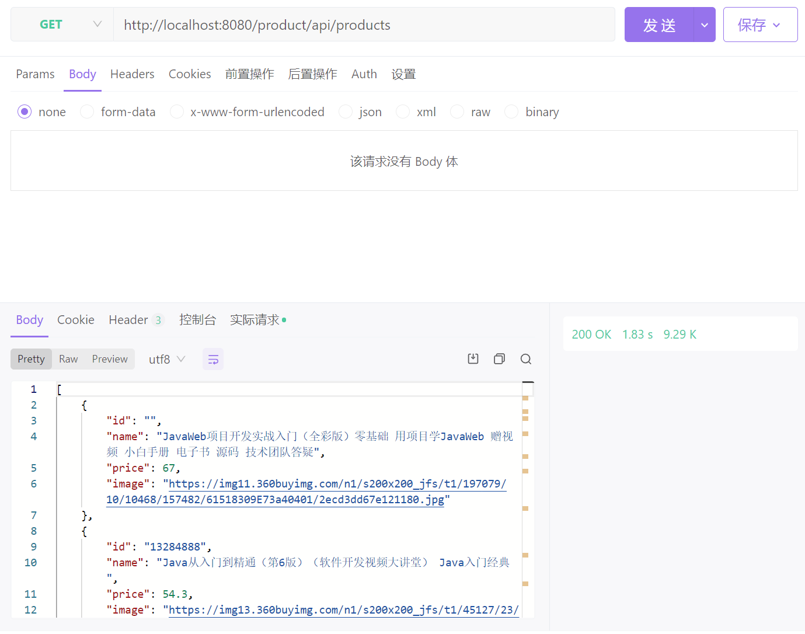
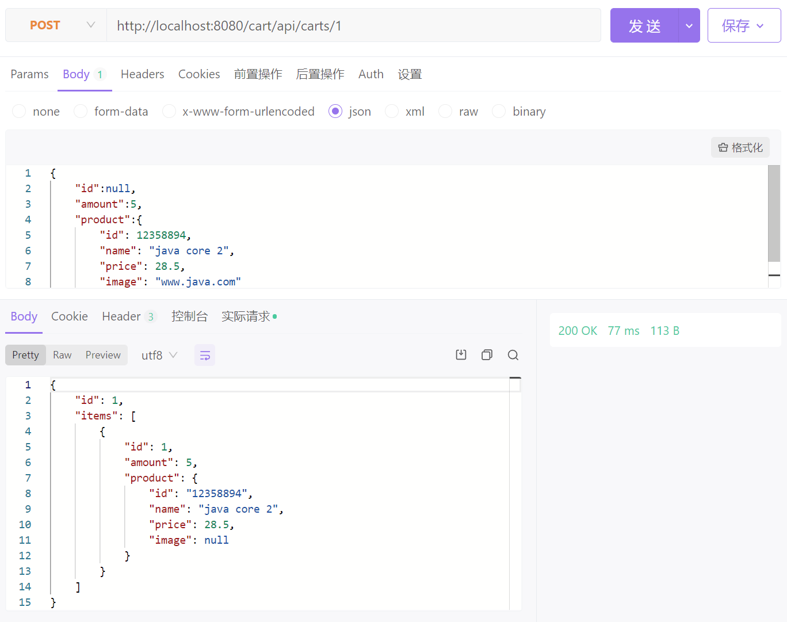

# aw08

Run the project with `mvn spring-boot:run` and send request to `http://localhost:8080/check`. You should see an reponses in json format like the following.

```json
{
    "icon_url": "https://assets.chucknorris.host/img/avatar/chuck-norris.png",
    "id": "kswv7NIaTCaIIErlBzODaA",
    "url": "https://api.chucknorris.io/jokes/kswv7NIaTCaIIErlBzODaA",
    "value": "Chuck Norris's shadow weighs 250 pounds and can kick your ass ."
}
```

Try to understand the provided code which demonstrates spring integration between a spring boot application with an externel http service (https://api.chucknorris.io/jokes/random).

Please implement delivery as an standalone service (just like the random joke service). Refer the sample code to integrate your Micropos system with delivery service so that user can check delivery status on Miropos which actually forwards user request to delivery service on demand.


Consider the advantage by doing so and write it down in your readme file.

---

- 在aw07中，当cart结算时会自动向消息队列中塞一条消息，然后delivery service取走，这样代码比较的简洁，但是依然要在两个服务之间简单配置消息队列，并且指定Consumer或者Function以进行处理。
- 在aw07基础上将`pos-delivery`服务改为了响应式服务并与其他服务相互独立。使用IntergrationFlow创建inGate与outGate两模块通过自建channel进行通信
  - delivery 服务从由 eureka+gateway 访问，变为由 gateway 通过 IntegrationFlow 访问。
  - 对于cart和delivery模块，他们实现松耦合，从而提高了各自的扩展性和可复用性。


---

下为一些测试截图



